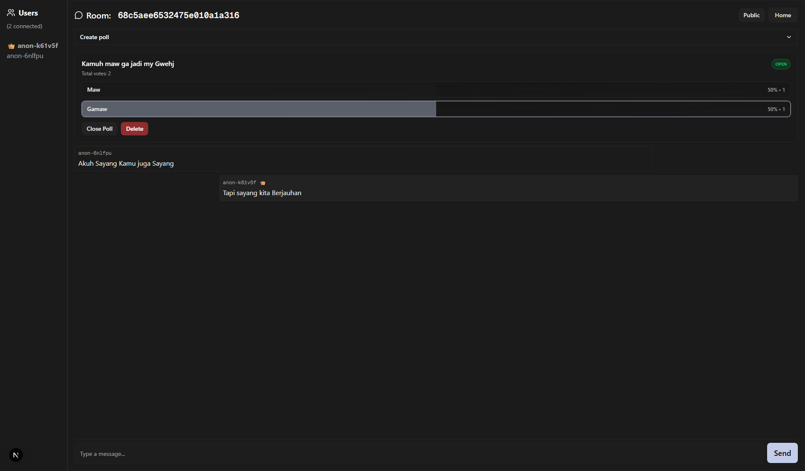

# AnonChat 🕵️‍♂️💬

AnonChat is an **anonymous real-time chat and polling app** built with **Next.js 15 (App Router)**, **MongoDB**, **Tailwind CSS**, and **Server-Sent Events (SSE)**.  
It allows anyone to create or join chat rooms, send messages, run polls, and interact **without needing an account**.

---

## ✨ Features

- 🔒 **Anonymous Rooms** – anyone can create or join without login
- 👑 **Room Ownership** – first user becomes the room owner
- 💬 **Real-time Chat** – messages instantly broadcast to everyone
- 📊 **Polls & Voting** – room owners can create polls, users can vote
- 👥 **User Presence** – see who’s connected in real-time
- ⏳ **Auto Cleanup** – rooms are deleted if the owner leaves or no users remain
- 📡 **WebRTC Signaling** – basic signaling API for peer-to-peer features
- ⚡ **Server-Sent Events (SSE)** – lightweight real-time updates
- 🎨 **Modern UI** – styled with Tailwind + shadcn/ui components

---

## 🚀 Tech Stack

- [Next.js 15 (App Router)](https://nextjs.org/)
- [React 19](https://react.dev/)
- [MongoDB](https://www.mongodb.com/)
- [Tailwind CSS v4](https://tailwindcss.com/)
- [shadcn/ui](https://ui.shadcn.com/)
- [SSE](https://developer.mozilla.org/en-US/docs/Web/API/Server-sent_events) for real-time updates

---

## 📂 Project Structure

```

.
├── lib/              # Database & utility functions
├── src/app/          # Next.js app (API + pages)
│   ├── api/room/     # API endpoints (rooms, messages, polls, signals, state, SSE)
│   ├── page.tsx      # Homepage
│   └── room/\[id]/    # Room page
├── src/components/   # Reusable UI components
├── public/           # Static assets
└── example.env       # Example environment variables

```

---

## ⚙️ Setup & Installation

### 1. Clone the repo

```bash
git clone https://github.com/MasFana/AnonChat.git
cd AnonChat
```

### 2. Install dependencies

```bash
npm install
# or
yarn install
# or
pnpm install
# or
bun install
```

### 3. Configure environment variables

Copy `example.env` → `.env.local` and set at minimum:

```
MONGODB_URI=mongodb://127.0.0.1:27017/anonchat
```

Optional tuning variables (defaults shown; you can omit):

```
OWNER_AWAY_GRACE_MS=5000            # grace before deleting room when owner absent
RECENT_USER_WINDOW_MS=15000         # users active if lastSeen within this window
STALE_USER_PRUNE_MS=15000           # users older than this are pruned
PRESENCE_INTERVAL_MS=5000           # presence & cleanup loop interval
HEARTBEAT_INTERVAL_MS=15000         # SSE ping keep-alive interval
LAST_SEEN_WRITE_THROTTLE_MS=4000    # min gap between lastSeen writes per user
MAX_SNAPSHOT_MESSAGES=5000          # cap messages returned in initial snapshot
USERS_LASTSEEN_TTL=60               # TTL (seconds) safety net index for users
```

### 4. Run development server

```bash
npm run dev
```

Visit 👉 [http://localhost:3000](http://localhost:3000)

---

## 🛠 API Endpoints

### Rooms

- `POST /api/room` → create a new room (first user = owner)
- `GET /api/room` → list active rooms

### Join & Messages

- `POST /api/room/[id]/join` → join room
- `POST /api/room/[id]/message` → send message

### Polls

- `POST /api/room/[id]/poll` → create poll (owner only)
- `GET /api/room/[id]/poll` → list polls
- `POST /api/room/[id]/poll/[pollId]` → vote
- `PATCH /api/room/[id]/poll/[pollId]` → update (owner only)
- `DELETE /api/room/[id]/poll/[pollId]` → delete (owner only)

### Real-time & State

- `GET /api/room/[id]/sse` → subscribe to live updates
- `GET /api/room/[id]/state` → fetch current state
- `POST /api/room/[id]/signal` / `GET /api/room/[id]/signal` → signaling for WebRTC
- `GET /api/anon` → secure anonymous ID (crypto-based randomness)

### Maintenance Scripts

```
# Migrate legacy string roomId fields to ObjectId (run once after upgrade)
node scripts/migrate-roomid-objectid.ts

# Migrate legacy poll documents whose roomId is still a string
node scripts/migrate-polls-roomid-objectid.ts

# Create / ensure indexes (idempotent)
node scripts/create-indexes.ts

# Dry run migration
DRY_RUN=1 node scripts/migrate-roomid-objectid.ts
```

PowerShell example:

```
$env:MONGODB_URI="mongodb://127.0.0.1:27017/anonchat"; node scripts/create-indexes.ts
$env:MONGODB_URI="mongodb://127.0.0.1:27017/anonchat"; node scripts/migrate-polls-roomid-objectid.ts
```

---

## 🧹 Room Lifecycle

- A room is **created** when the first user joins.
- If the **owner disconnects**, the room is deleted after a short grace period.
- If **no users remain**, the room is immediately deleted.
- All messages, polls, votes, signals and user presence docs tied to a deleted room are cleaned up.

### SSE Disconnect & Retry

When a room is deleted the server:

1. Emits a final `room-deleted` event (with `retry: 0` if a race occurs).
2. Client closes the EventSource and redirects to `/?msg=Room+Closed`.
3. Future connections receive **410 Gone**, preventing auto-reconnect loops.

---

## 📦 Deployment

The app is fully compatible with **Vercel** or any Node.js hosting provider.
For production, set at least:

```
MONGODB_URI=your-production-mongodb-uri
```

Optional overrides (copy only if changing defaults):

```
OWNER_AWAY_GRACE_MS=5000
RECENT_USER_WINDOW_MS=15000
STALE_USER_PRUNE_MS=15000
PRESENCE_INTERVAL_MS=5000
HEARTBEAT_INTERVAL_MS=15000
LAST_SEEN_WRITE_THROTTLE_MS=4000
MAX_SNAPSHOT_MESSAGES=5000
USERS_LASTSEEN_TTL=60
```

---

## 📸 Screenshots (optional)

### Dashboard


### Room (Owner)



### Room (Client)


---

## 🤝 Contributing

PRs are welcome! Feel free to fork and improve this project.

---

## 🔍 Advanced Notes

### Presence & Cleanup

The presence loop (every `PRESENCE_INTERVAL_MS`) throttles writes to `lastSeen`, prunes stale users older than `STALE_USER_PRUNE_MS`, and manages an owner-away grace period (`OWNER_AWAY_GRACE_MS`).

### Anonymous ID Security

Anonymous IDs now use `crypto.randomUUID()` or `crypto.randomBytes()` for strong randomness instead of `Math.random()`, reducing predictability.

### Snapshot Capping

Initial SSE / state responses cap messages at `MAX_SNAPSHOT_MESSAGES` to avoid large payloads and memory spikes.

### Room Deletion Cascade

A single helper removes `rooms`, `users`, `messages`, `polls`, `votes`, `signals` ensuring no orphan documents.

### SSE Reconnect Prevention

After deletion the client closes the stream and 410 responses prevent automatic browser retries.

---
